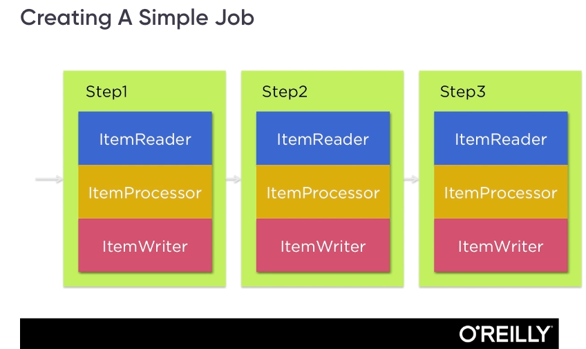
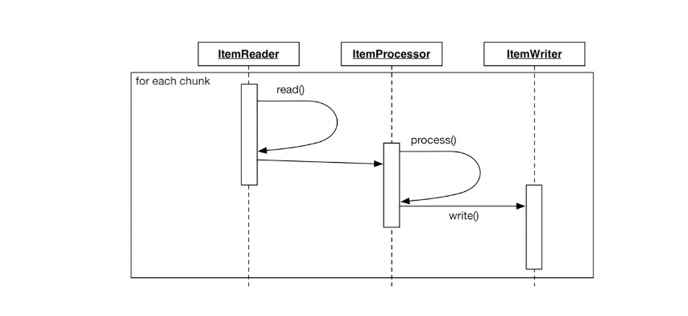
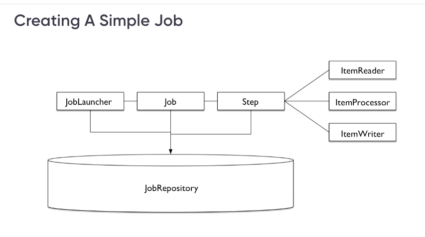
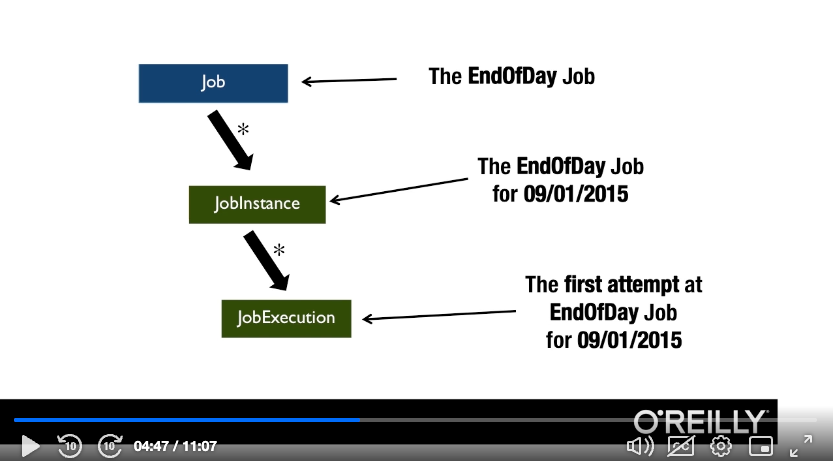
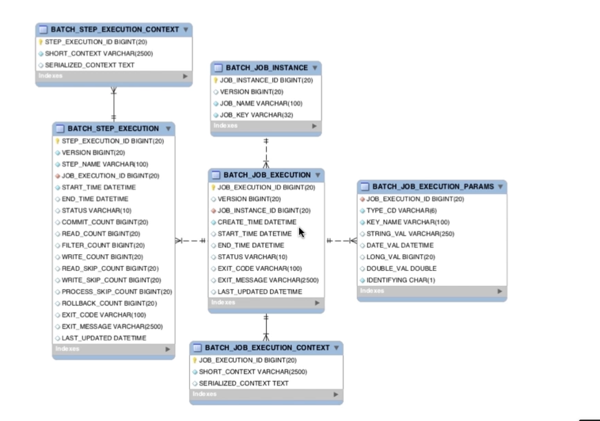
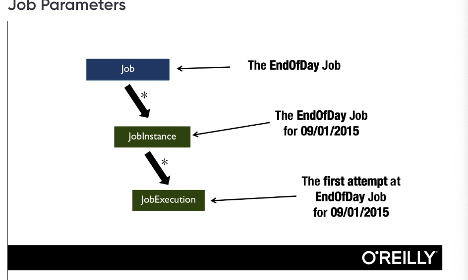

**Important Concepts in SpringBatch**
 

```
(a)Job
 
(Defines a List of States and Steps and How to transition between one State and the Next)

Spring Batch at the most fundamental level is a State Machine

A Spring Batch Job defines the flow that processing will take through states

Each step reprersents a state within a state machine

A JOB Represents a list of states in the spring BATCH state machine and how
to transition between those states

It takes in Steps.


```


```
(b)Step
[Two types of Steps: TaskLet, ChunkStep]
[A tasklet step executes recdursively until it returns: finshed, null or exception

```


**Tasklet Step**

```
Is a Single interface with the mehthod execute, and spring boot runs
that single method within the scope of a transaction

[Executes one Single process within the scope of a transaction.]
[anything outside item based processing]

If i want to maybe do one thing in a Job, without extra processing a tasklet
would be ideal.

(eg ftp file, send email, anything outside item based processing.

There are outof thebox tasklets that we can leverage to do our development
(systemCommandlineTaskLet,)

```


*Chunk Based Step**

```
It is ItemBased

When we look at a chunk based step we expect to be processing items individually.
It has three main components:

(a)Item Reader - Responsible for all the input of the Step.

(b)Item Processor - It is Optional 
[Provides any additional transformation,validation or Logic that 
needs to be applied to each Item.

(c)Item Writer  - Provides the OutPut of the Step

```

**Simple Representation of a Job with Steps**



```
The execution of the above job can be step by step,
parallel

```

*Chunk Step Process Flow**


```
(a)First of all we by reading until the chunk  limit is attained .
 [If chunk size is 100, we shall begin first by reading the 100 items]
 
(b)We then Iterate over each of the 100 items with the item processor,

(c) Once all the items have been processed the whole list is passed into the 
item writer, where the write method, will write all of the items in the chunk 
at Once.

[This allows foe Optimization in the Write which we cannot do in these other Steps

[Example, if we are using jdbc we can do a batch insert]

This process is repeated until all the input is exhausted
Therefore if i have 1000 items, i will have 10 chunks, if each chunk has 100 items

```


**Job Repository**

```
As the Job transitions between the various phases of a Job, State is maintained,
State is maintained in a Job Repository

Out of the Box, Spring provides two repositories,

(a)Mapped One - Testing Puproses (uses hashMaps in JDBC)
(b)JDBC One - Relational Database

Data stored in Job repository is provided by the various components.
If something goes wrong,we are able to restart at the step where the error occured

wow, soemthing very important, Spring Batch Stores the state of the Job as it executes
This is why we need at least an inmemeory DB when running a SpringBatch Application

@EnableBatchProcessing, uses whatever datasource has been provided to create a Job repository
spring batch stores the state of a Job in a Job repository as it executes

```



```
(a)A job is a flow of state or steps that we progress through
(b)When we run a Job,we create a Job Instance / Job Execution

(In above example, we have one Job Instance for each day)
(Each time we launch a Job, we create a Job execution)
(A single Job Instance, can have many Executions)

(Example if a Job started running then failed, when restarted, it will
have a different execution id)

(It will have the same instance but different execution)
(A job instance is considered complete if one of the  Job execution goes up to the end state)

Summary
One Job can have many Job Instances, (Logical run of a Job)
One Job instance can have many Job executions (Physical run of a JOB)

```



```
Summary of tables:

(a)batch_job_instance->Batch Job Instance -  takes in the job name and job key

[The key is a hash of params that specifically distunguishes the Job)]

(b)batch_job_execution->Batch step execution stores the pysical run of each Job

we have a special column of STATTUS, and EXIT_CODE

STATUS->Spring batch has specific distinct statuses which
Can be COMPLETED,STARTING,STARTED,STOPPING,STOPPED,FAILED,ABANDONED,UNKNOWN

EXIT_CODE-->Spring batch gives us the ability as developers to set the exit code
we can set it with any programmatic message we wish.

EXIT MESSAGE ->IF an exeption is thrown during processing, we are able to see the stack
trace under the exit message.

(c)batch_job_execution_params ->stores extra params if need be.

(d)batch_step_execution ->one to many relationship with batch_job_execution
(e)batch_job_execution_context

(if an execution fails somwhere in between steps, it will restart from where it left off.

(f)batch_step_execution_context -->greatly helps in restarting a step from where it was if it fails
from somewhere in between

waah, out of the box.
If a flatfileitem reader fails, it will restart from where it left off.

```

**Decider**

```
For us to make a complex decision on which step to execute next,based on certain conditions,
spring batch has an interface called the decider.

Transitons, (where you execute next step based on the exit condition are one Option)

Howerver, transitons do not allow for more complex logic to be used in deciding what
the next step will be, this is where we need decider

```

**Job Step**

```
For more complex flows, we can be able to nest JOBS by having a JOB Step
A Job step launches another jOB within the scope of a Step

When we execute a Job within another JOB it is executed within the same JVM by default
Within the sama JVM and execution thread

If child job fails, if i have many JOB Steps,execution will stop from the parent JOB

```

**JOB Listeners**

```

We can be able to hook into the JOB LifeCycle at any given point

(a)jobExecutionListener

 (provides before and after job exeuction listeners)

(b)StepExecution Listener

(c)ChunkListners
before and after chunk

provides a method to be called after an error within chunk for additional
error handling

(d)Itemreadlistener
(e)Item processListener
(f)ItemWriteListener

```


**Job Parameters**

```
Job Parameters are used to identify a Job instance
A job instance is a logical run that can have many ezecutions
i can pass a specific param to identify a specific job insance

@StepScope comes in when we are running Job instances with parameters

Unlike other beans that are instantiated during startUp, (SingleTon)
    The stepScope is Lazily loaded, and instantiates at the time
    the bean calling it is being executed
    HelloWorld One will not be instantiated at startup, but will rather be instantiated at the time
    the step is being executed
    In the meantime a Proxy is used in its place to satisfy the dependency
    
Job parameters help us in restarting a Job where it failed from
```

**ItemReaders**

```
There is a huge versitility of item readers and wirters avalable in Spring Batch
State pf current read is maaintained and spring batch handles reatrtability very elagantly
```


**Reading from DATABASE**
```

(A)JDBC Cursor item reader

it opens up a cursor, and we are able to read data and map it into an OBJECT
IT IS STATEFUL IN THAT IF SOMETHING HAPPENS MID WAY READING I CAN RESTART FROM WHERE I LEFT OFF

Draw back, it is not thread safe
OrderBy is very, very important for restartability [By ordering that is how we are able to remember our sequence)
By ordering, it helps the item reader track on state

(B)JDBC Pager item reader

Jdbc Paging Item reader reads our input page by page
unlike the cursor reader that tracks only the number that was read.
the JDBC tracks the exact key for each value read via the SortKeys
used to order the data and keep track of the last key read
the sortkey must be a unique key
other item readers include: JdbcPagingItemReader, HibernateItemReader, etc

```

**Reading from XML**

```
The individual items in the XML Object are considered as seperate chunks

```

**Managing of State Within a Step**

```

Similar to jobExecution Listener which can help me hook into the lifecycle of a Job, But this is in a Step

(a)ItemStream 

Within a Step, State is just as important,this is where ItemStream comes in
Item Stram interface

Help a developer to get access to the component where state is maintained

(b)ExecutionContext
Both the Job and the step have execution context that maintains state
(Ellaboate map that contains state of the component)

(Execution context is where state is stored as the component runs)

(If i want to hook into the LifeCycle of a Step, this is where the Item Stream interface comes In)

```


**Item Processor**

```

//Basics ->Step One
	//in a chunk step, the item reader is responsible for reading Input
	//the item Writer for Writing the Output
	//In the Processor However is where all the business Logic seats
	
	
//The process method in the Item Processor is allowed to change the type if need be
//It can for instance take in a customer Object and return an Accounts Object if the customer is related to the account

//processor can also be used to fitler item,
//if we return null to a process call, the items that return null are filtered out

```
*Notes By*

```
MbuguaCaleb

```